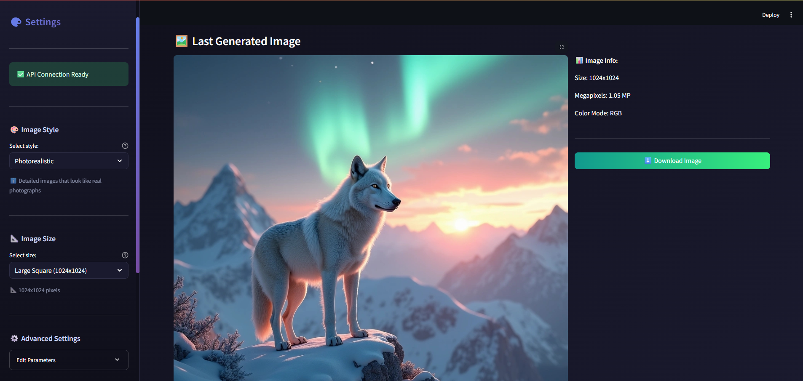
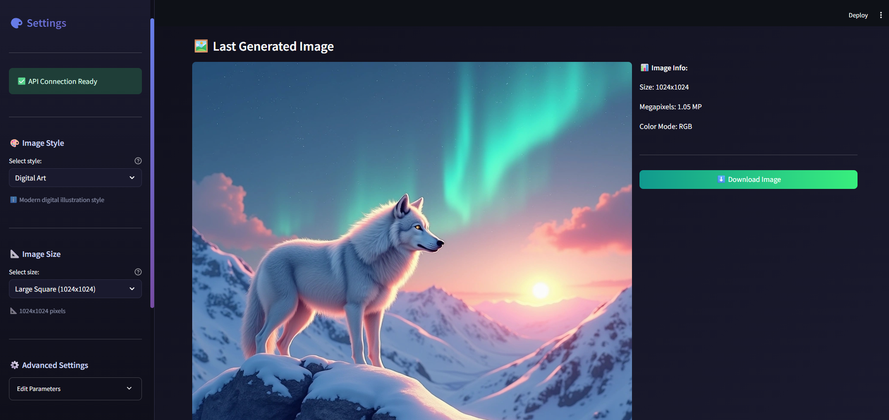
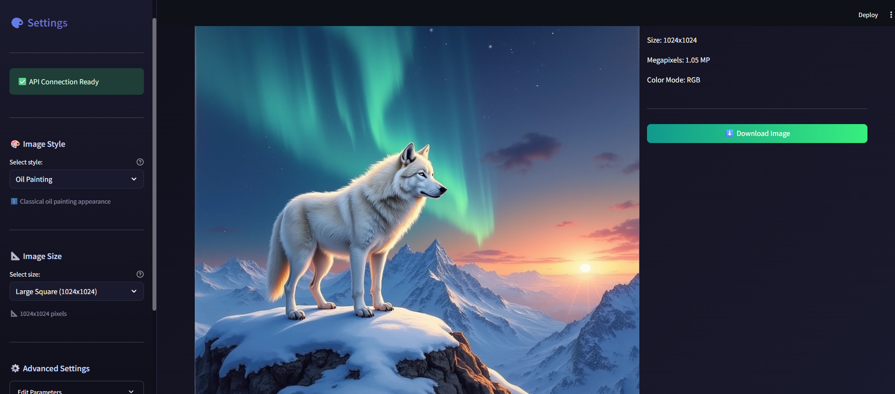
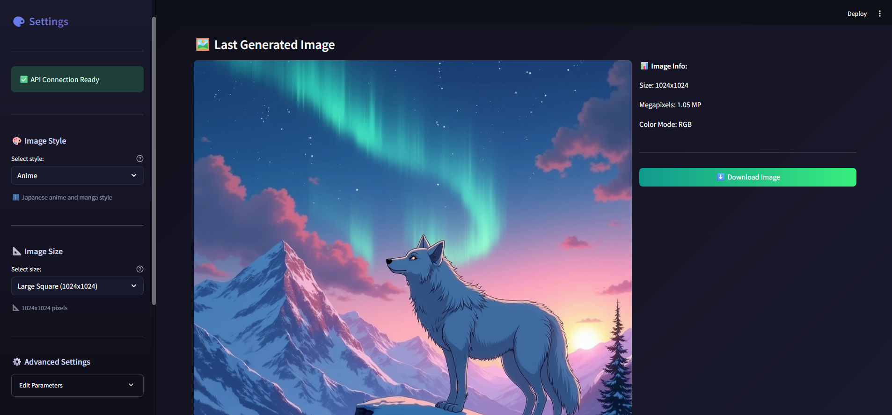
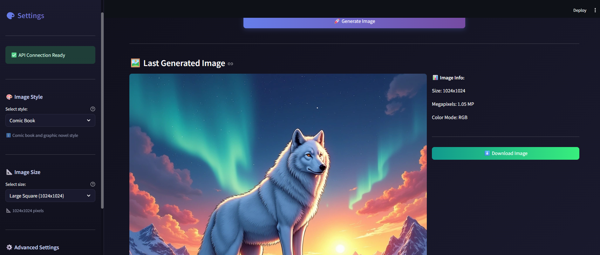
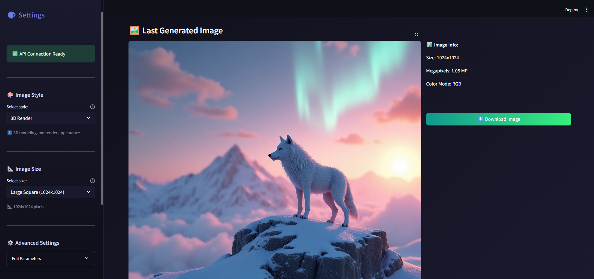
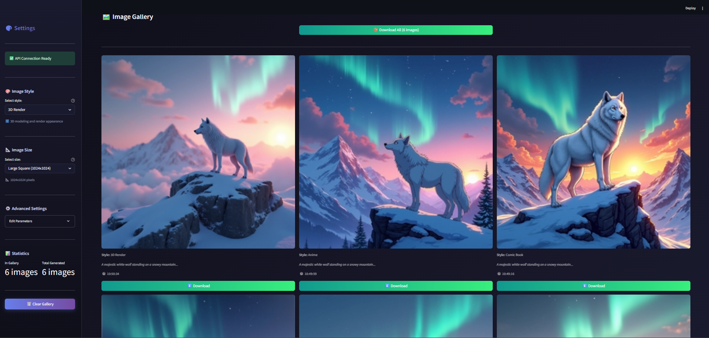

# 🎨 AI Text-to-Image Generator

A web application that generates images from text descriptions using Hugging Face's AI models. Built with Streamlit for an interactive user experience.


## Features

- **Text-to-Image Generation**: Describe what you want, and AI creates it
- **Multiple Art Styles**: Photorealistic, Digital Art, Oil Painting, Anime, 3D Render, and more
- **Customizable Parameters**: Adjust image size, quality steps, and guidance scale
- **Image Gallery**: View and manage all generated images in one place
- **Batch Generation**: Create multiple variations with a single prompt
- **Easy Download**: Download individual images or all at once as ZIP

## Style Examples

Same prompt, different styles - see how AI interprets your description in various art forms:

> *"A majestic white wolf standing on a snowy mountain peak at sunset, northern lights in the sky"*

| Photorealistic | Digital Art | Oil Painting |
|:---:|:---:|:---:|
|  |  |  |

| Anime | Comic Book | 3D Render |
|:---:|:---:|:---:|
|  |  |  |

## Gallery View



## Tech Stack

- **Frontend**: Streamlit
- **AI Model**: FLUX.1-dev via Hugging Face Inference API
- **Image Processing**: Pillow (PIL)
- **Language**: Python 3.10+

## Installation

1. Clone the repository:
```bash
git clone https://github.com/mmehmetisik/ai-text-to-image-generator.git
cd ai-text-to-image-generator
```

2. Create and activate virtual environment:
```bash
python -m venv venv
source venv/bin/activate  # On Windows: venv\Scripts\activate
```

3. Install dependencies:
```bash
pip install -r requirements.txt
```

4. Create `.env` file and add your Hugging Face API key:
```
HUGGINGFACE_API_KEY=your_api_key_here
```

5. Run the application:
```bash
streamlit run app.py
```

## Usage

1. Enter your image description in the text area
2. Select an art style from the sidebar
3. Adjust image size and other parameters if needed
4. Click "Generate Image" and wait for the result
5. Download your image or generate more variations

## Available Styles

| Style | Description |
|-------|-------------|
| Photorealistic | Images that look like real photographs |
| Digital Art | Modern digital illustration style |
| Oil Painting | Classical oil painting appearance |
| Watercolor | Soft and flowing watercolor effect |
| Comic Book | Bold lines and dynamic comic style |
| Anime | Japanese anime and manga style |
| Minimalist | Clean and simple design |
| Abstract | Artistic abstract expression |
| 3D Render | Pixar-style 3D modeling look |
| Sketch | Pencil drawing style |

## Project Structure

```
ai-text-to-image-generator/
├── app.py                 # Main application
├── requirements.txt       # Dependencies
├── .env                   # API key
├── assets/
│   └── style.css          # Custom styles
├── config/
│   ├── settings.py        # App configuration
│   └── style_presets.py   # Art style definitions
└── utils/
    ├── gallery_manager.py # Gallery operations
    ├── hf_api_handler.py  # Hugging Face API
    ├── image_processor.py # Image utilities
    └── logger.py          # Logging system
```

## Getting Your API Key

1. Create an account at [Hugging Face](https://huggingface.co)
2. Go to Settings → Access Tokens
3. Create a new token with "Read" permissions
4. Copy the token to your `.env` file

## License

This project is open source and available under the MIT License.

## Author

**Mehmet Işık**

- GitHub: (https://github.com/mmehmetisik)
- LinkedIn: (https://www.linkedin.com/in/mehmetisik4601/)
- Kaggle: (https://www.kaggle.com/mehmetisik)
